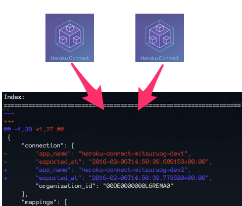

# heroku-connect-configuration-compare [](https://travis-ci.org/mitsuruog/heroku-connect-configuration-compare)

> Fetch two Heroku Connect Configuration and Compare together



## Prerequisite

In order to get started, you need to install [Heroku Toolbelt](https://toolbelt.heroku.com/) and [heroku-connect-plugin](https://github.com/heroku/heroku-connect-plugin) at globally.  
Let's check following:

```
$ heroku version
heroku-toolbelt/3.42.33 (x86_64-darwin10.8.0) ruby/1.9.3
heroku-cli/4.27.19-c3e4415 (amd64-darwin) go1.5.3
=== Installed Plugins
heroku-apps@1.2.3
heroku-cli-addons@0.2.0
heroku-connect-plugin@0.2.0  <= required
heroku-fork@4.1.1
heroku-git@2.4.5
heroku-local@4.1.6
heroku-run@2.9.2
heroku-spaces@2.0.13
heroku-status@2.1.0
```

## Install

```
$ npm install --save heroku-connect-configuration-compare
```


## Usage

```js
const herokuConnectConfigurationCompare = require('heroku-connect-configuration-compare');

herokuConnectConfigurationCompare('one-heroku-appname', 'other-heroku-appname');

```

## API

### herokuConnectConfigurationCompare(appName1, appName2)

#### appName1

Type: `string`

the first heroku app name to be compared.

#### appName2

Type: `string`

the second heroku app name to be compared.

## CLI

```
$ npm install --global heroku-connect-configuration-compare
```

```
$ heroku-connect-configuration-compare --help

  Usage
    heroku-connect-configuration-compare [appName1] [appName2]

  Examples
    $ heroku-connect-configuration-compare one-heroku-appname other-heroku-appname

```


## License

MIT © [mitsuruog](https://github.com/mitsuruog)
